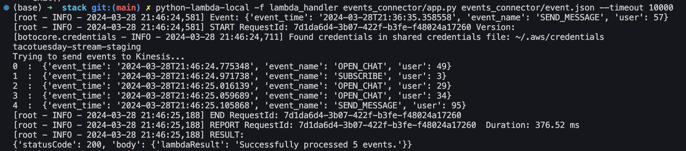
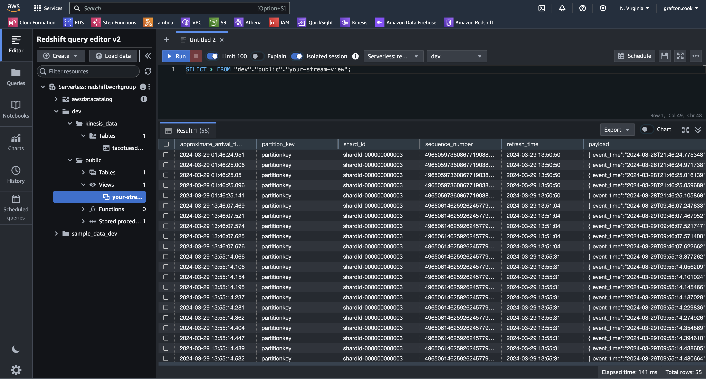

# Streaming Data Pipeline with AWS Kinesis and Redshift

## Project Overview
This project demonstrates the creation of a streaming data pipeline using AWS Kinesis and Redshift. The goal was to connect server event streams with a data warehouse solution and transform the data for analytics dashboard creation.

## Milestone 1: Create an Amazon Kinesis Data Stream
- Created an S3 bucket and deployed a Kinesis stack using CloudFormation templates.
- Managed ring deployment environments (e.g., `staging` vs `prd`).

## Milestone 2: Create an Amazon Kinesis Delivery Stream
- Developed a Python script for a Lambda function to generate random events.
- Tested the Lambda function locally using python-lambda-local.
- Lambda function generated event time, event name, and user ID for each event.

## Milestone 3: Provision an Amazon Redshift Cluster
- Created a Redshift cluster and an external schema for Kinesis data.
- Generated and streamed data to Redshift using the Lambda function.
- Created a materialized view in Redshift for data analysis.

## Key Learnings
- Advanced deployment using bash shell and CloudFormation.
- Handling JSON data in Lambda and Redshift.
- Importance of AWS region alignment.

## Future Goals
- Explore more complex data processing and event-driven architectures.
- Extend the pipeline for comprehensive data analysis and visualization.
